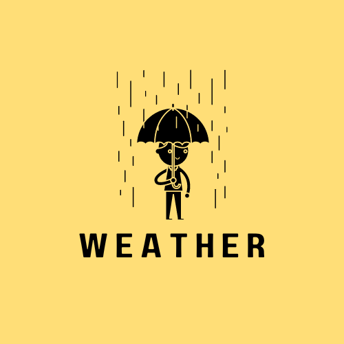
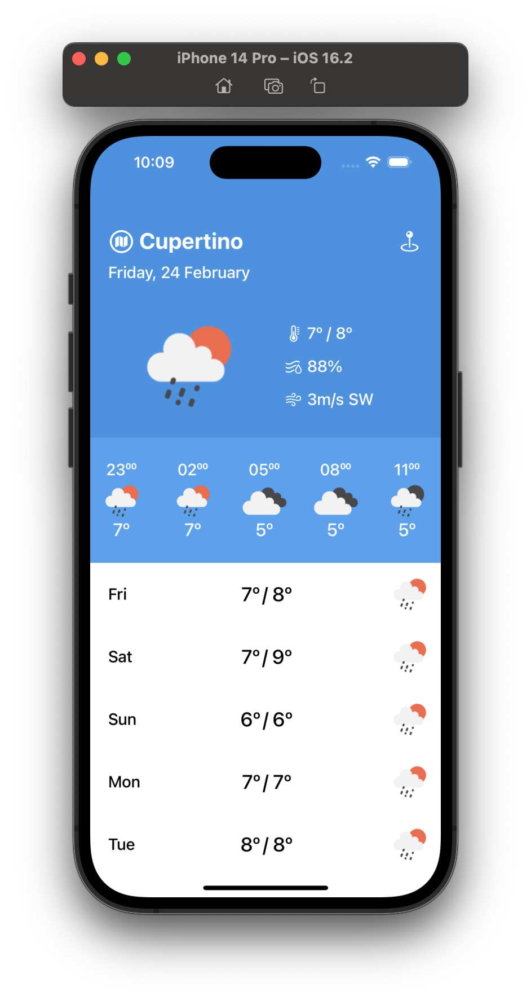
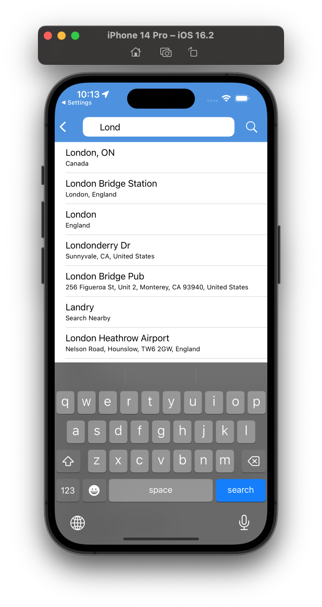
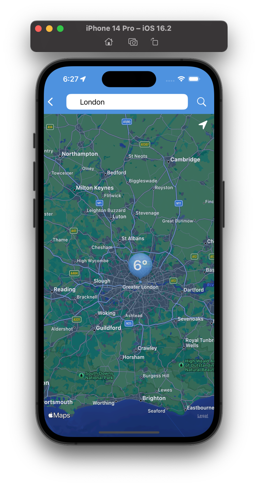

# Weather App

	

</a>

<a href="https://www.swift.org">

<a href="https://developer.apple.com/documentation/ios-ipados-release-notes/ios-ipados-16_2-release-notes">

	

## Main screen:
- Today's forecast
- Forecast for the next few days
- Maximum/minimum temperature
- Average humidity
- Wind speed and direction

## Map:
- Determination of the current location;
- Selection of a point on the map with subsequent loading of weather by coordinates on the main screen.

## City search:
- Search for settlements with autocomplete on keyboard input;
- Selection of a settlement with subsequent loading of weather on the main screen.

## Used:
- Adaptive layout.
- Consideration of screen rotation
- MVP + Coordinator design pattern
- Dependency injection + SnapKit library Cocoapods
- Swift UIKit without storyboard

## Weather API:
- [openweathermap](https://openweathermap.org/api)

## Pictures:

	

</a>

</a>

